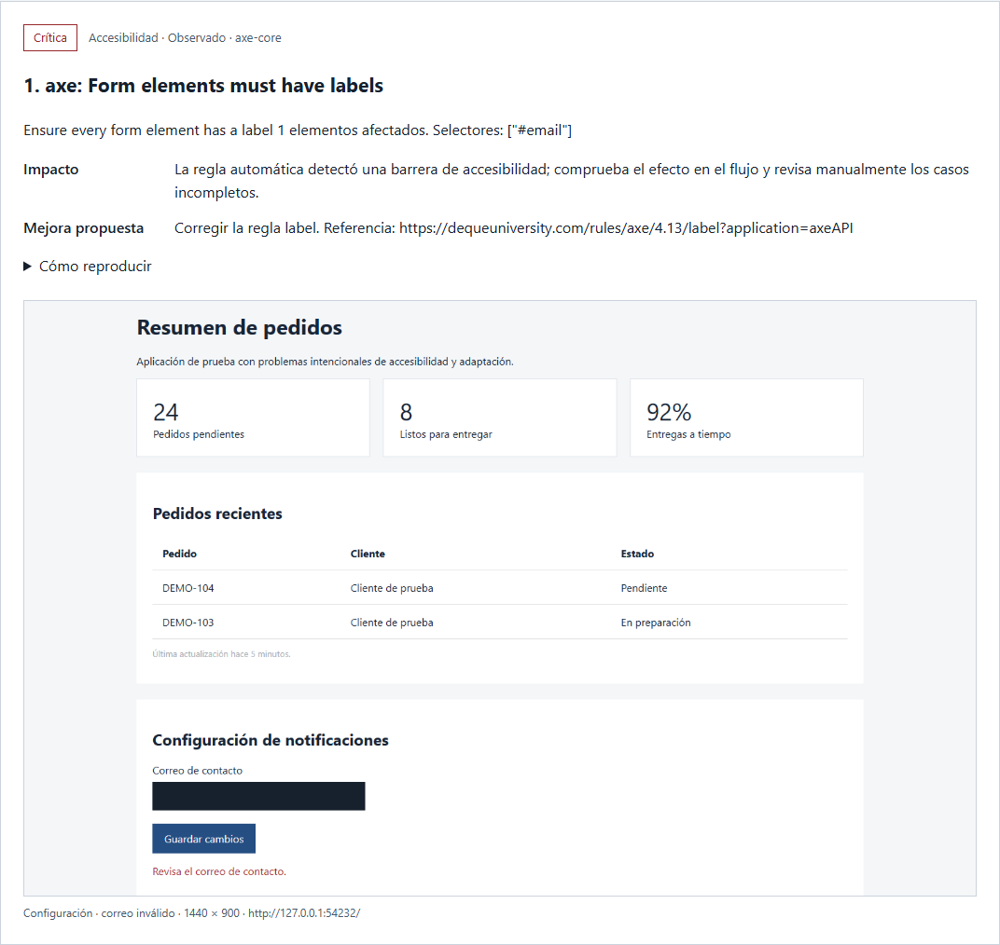

# UI Auditor

Servidor MCP local para evaluar aplicaciones web con **Codex, Claude Code o Cursor Agent**. Reutiliza herramientas existentes y añade la organización de la auditoría y un reporte con evidencia visual.

- **[Playwright MCP](https://github.com/microsoft/playwright-mcp):** navegación, clics, formularios, teclado, pestañas, capturas, consola y solicitudes de red. Las herramientas `browser_*` provienen de Microsoft; no se reimplementan.
- **[axe-core](https://github.com/dequelabs/axe-core):** reglas de accesibilidad sobre el estado y la sesión que está explorando el agente.
- **[Lighthouse](https://github.com/GoogleChrome/lighthouse):** rendimiento de navegación, métricas y reporte original en móvil o escritorio.
- **El agente:** revisión visual y de los flujos, interpretación de evidencias, prioridades y propuestas de mejora.
- **UI Auditor:** guía de evaluación, registro persistente de evidencia y hallazgos, cobertura y reporte HTML con imágenes incorporadas.

No necesita claves de API adicionales: utiliza el agente que ya tengas conectado. El servidor no ejecuta un modelo ni empieza a auditar por sí solo; el agente dirige la exploración con sus herramientas.



La imagen corresponde a una aplicación de prueba con defectos intencionales. Los reportes separan errores y mejoras, puntúan cada aspecto de 1 a 100 con lo que falta para llegar a 100 y marcan la zona de cada problema en capturas reales.

## Instalación

Requisitos: Node.js 22.19 o posterior, Google Chrome y un agente local compatible con MCP. Ejecuta:

```powershell
git clone https://github.com/andersonmorillo/ui-auditor-agent.git
cd ui-auditor-agent
npm ci
npm run setup
```

`setup` crea `.mcp.json` para Claude Code y `.cursor/mcp.json` para Cursor, con las rutas absolutas de esta instalación. Conserva los otros servidores configurados y no reemplaza un `ui-auditor` que apunte a otra instalación. Estos archivos son locales y están excluidos de Git. Si mueves el clon, elimina solo su entrada `ui-auditor` de esos archivos antes de volver a ejecutar `setup`.

## Configuración global para otros proyectos

Instala el auditor una vez y registra el MCP en la configuración de usuario del agente. El cliente inicia el servidor local cuando se conecta, usando esta instalación; puedes evaluar cualquier aplicación accesible desde ese computador.

**Codex:** copia y ejecuta el comando `codex mcp add` que imprime `setup`. Se guarda en `~/.codex/config.toml` y queda disponible al abrir otros proyectos. Comprueba después que el servidor aparece:

```powershell
codex mcp list
```

**Claude Code:** ejecuta el comando `claude mcp add --scope user --transport stdio ui-auditor -- ...` que imprime `setup`. Se guarda en `~/.claude.json` para todos tus proyectos. Verifica la conexión desde otra carpeta:

```powershell
claude mcp get ui-auditor
```

**Cursor y Cursor Agent:** añade la entrada `ui-auditor` de `.cursor/mcp.json` a `~/.cursor/mcp.json`, dentro de `mcpServers`, conservando los demás servidores. `~` representa tu carpeta de usuario. Puedes comprobar las herramientas desde otra carpeta:

```powershell
cursor-agent mcp list-tools ui-auditor
```

Los comandos impresos y las entradas JSON contienen las rutas absolutas del clon donde instalaste las dependencias. Si mueves esa carpeta, actualiza también las rutas de las entradas globales.

Fuentes: [MCP en Codex](https://learn.chatgpt.com/docs/extend/mcp?surface=cli), [ámbito de usuario en Claude Code](https://code.claude.com/docs/en/mcp#user-scope), [configuración global de Cursor](https://cursor.com/docs/mcp#configuration-locations).

## Configuración por proyecto

Claude Code carga `.mcp.json` desde este proyecto; Cursor usa `.cursor/mcp.json`. Si prefieres configurar el auditor para un proyecto concreto, añade la entrada `ui-auditor` generada por `setup` a la configuración de ese proyecto, conservando sus otros servidores. Una entrada con el mismo nombre definida por el proyecto puede tener prioridad sobre la global.

Los agentes remotos necesitan su propia instalación del servidor y acceso a la aplicación que se evalúa.

Después de recargar los MCP, confirma que aparecen `audit_start`, `audit_capture` y `browser_navigate`. `npm start` inicia el transporte stdio; no abre un sitio ni un puerto HTTP.

## Solicitar una evaluación

Puedes usar el prompt MCP `audit_application`, o pedirle al agente:

> Usa ui-auditor para evaluar http://localhost:3000. Comprueba el inicio de sesión, la búsqueda y la creación de un registro con datos de prueba. Revisa escritorio, tablet y móvil; usabilidad, accesibilidad, diseño visual, navegación, funcionamiento, estados y errores, rendimiento, adaptación, compatibilidad y experiencia. Interactúa realmente con la página, captura los problemas y genera un reporte HTML con mejoras priorizadas. Indica qué no pudiste comprobar y distingue hechos de hipótesis.

El servidor devuelve instrucciones al agente y proporciona un checklist para diez aspectos. Conviene definir las tareas, roles y rutas que importan: una visita a la página de inicio no demuestra que se haya revisado toda la aplicación.

## Flujo y herramientas propias

1. `audit_start`: define URL, tareas y alcance; devuelve `audit_id`.
2. `browser_*`: el agente navega y realiza las tareas mediante Playwright MCP.
3. `audit_capture`: guarda el viewport seleccionado, devuelve la imagen y `evidence_id`, ejecuta axe y recoge tiempos de navegación. Se puede omitir axe con `run_axe: false`. Si una regla axe o un desbordamiento se repite en la misma página, la nueva captura se añade al hallazgo existente en lugar de duplicarlo.
4. `audit_finding`: registra tipo (`kind`: `bug` si algo no funciona, se contradice o muestra datos incorrectos; `improvement` si funciona pero se puede mejorar), categoría, prioridad, observación, impacto, propuesta, pasos, evidencia y confianza. La evidencia puede ser una captura o una medición Lighthouse. `region: {x, y, width, height}` marca un área de una captura en píxeles del viewport.
5. `audit_lighthouse`: mide una URL pública en móvil o escritorio, guarda las métricas en la auditoría y devuelve una evidencia de rendimiento.
6. `audit_assess`: marca un aspecto como revisado, parcial o no aplicable, con explicación y evidencia. Los aspectos sin evaluación quedan pendientes.
7. `audit_report`: genera un solo HTML con imágenes incorporadas. Puede imprimirse o guardarse como PDF desde el navegador. Está pensado para leerse sin conocimientos técnicos:
   - **Resumen en números:** puntuación general, cantidad de errores y de mejoras, y problemas de accesibilidad automáticos.
   - **Por dónde empezar:** los 5 problemas de mayor prioridad.
   - **Puntuación por aspecto (1 a 100):** cada aspecto parte de 100 y resta puntos por problema abierto (crítica 25, alta 15, media 8, baja 3; la mitad si está por validar). Al abrir un aspecto se ve qué arreglar para llegar a 100 y cuántos puntos recupera cada arreglo.
   - **Errores y mejoras por separado:** cada tarjeta dice qué pasa, por qué importa y qué hacer, muestra la zona del problema y deja marcar si ya está corregido, si sigue sin corregir o si no era un problema. Se pueden filtrar por tipo, prioridad y pantalla.
   - **Detectado automáticamente:** las reglas de axe y los desbordamientos agrupados, una entrada por problema, con la misma marca.
   - **Respuesta:** el texto de abajo agrupa esas marcas. Pégalo en el agente: solo debe cambiar el código de lo que sigue sin corregir. Descargar el reporte guarda la respuesta dentro del mismo archivo.
   - Los datos técnicos (selectores, métricas por captura) quedan en `audit.json`, no en el reporte.

`audit_status` recupera la auditoría guardada usando su ID, incluso después de reiniciar el servidor. Cada hallazgo necesita una evidencia de esa auditoría; no se aceptan evidencias de otra auditoría ni regiones fuera de la imagen.

Los hallazgos automáticos de axe identifican reglas y selectores (guardados en `audit.json`); el agente debe inspeccionar esos elementos y capturar su ubicación si quedan fuera del viewport. Los casos `incomplete` se conservan para revisión manual. Detectar desbordamiento horizontal produce una hipótesis, porque puede ser intencional en una tabla.

## Reportes y sesiones

Se guardan en `reports/<audit_id>/`:

- `audit.json`: capturas, evaluaciones, hallazgos, resumen y resultados Lighthouse.
- `<evidence_id>.png`: captura del estado explorado.
- `<evidence_id>.json`: datos técnicos del estado capturado.
- `report.html`: el único HTML. Las imágenes van dentro, una sola vez, aunque varios hallazgos usen la misma captura. La lista de casillas vive aquí; al descargarlo, la respuesta marcada queda en el mismo archivo.
- `<evidence_id>-lighthouse.json`: resultado técnico de Lighthouse, si se ejecutó. Las métricas que se leen están dentro de `report.html`.

El navegador de exploración es visible por defecto. Puedes iniciar sesión manualmente en él o usar una cuenta de pruebas mediante el agente; la sesión se comparte entre las herramientas de navegación y axe. Al cerrar el servidor se cierra el navegador y se descarta la sesión. Los reportes permanecen.

Lighthouse **abre otro navegador, sin las cookies de la sesión explorada**, y navega de nuevo a la URL indicada. Si la aplicación redirige al inicio de sesión, estarás midiendo esa página: comprueba la URL final y su captura. Su resultado no representa un modal abierto ni un estado autenticado de la SPA. Para estos estados, registra la limitación en la cobertura.

`mask_selectors: ["#email", "[data-sensitive]"]` oculta elementos en la captura. No redacta selectores, URL, datos técnicos ni capturas Lighthouse; usa datos de prueba cuando el reporte se vaya a compartir.

Variables opcionales del servidor:

- `UI_AUDITOR_HEADLESS=1`: navegador sin ventana para CI y pruebas.
- `UI_AUDITOR_REPORTS`: directorio absoluto de reportes.
- `UI_AUDITOR_BROWSER`: `chrome` (predeterminado), `msedge`, `firefox` o `webkit`. Para los dos últimos instala el navegador de Playwright con `npx playwright install firefox` o `npx playwright install webkit`.

## Comprobación y demostración

```powershell
npm test
npm run demo
npm run demo -- --lighthouse
```

La prueba ejecuta un cliente MCP real contra una aplicación local con defectos intencionales: interactúa con el formulario, verifica axe y desbordamiento móvil, guarda imágenes, rechaza evidencia inexistente y comprueba el escape de HTML en el reporte. La demo imprime la ruta de un reporte real de esa aplicación de prueba; no evalúa una aplicación del usuario.

El workflow de GitHub Actions instala Node.js y Chrome en Ubuntu, ejecuta la prueba MCP y genera un reporte de demostración con Lighthouse. Se activa en pushes, pull requests y ejecuciones manuales.

## Qué requiere juicio humano

El checklist permite cubrir todos los aspectos de la interfaz, pero la cobertura depende de las tareas realmente exploradas. Un resultado automático no certifica accesibilidad; un único navegador no demuestra compatibilidad; la revisión de un agente no mide satisfacción de usuarios reales. Estas limitaciones deben quedar visibles como parciales o pendientes, con propuestas concretas de validación. Las pruebas de seguridad, carga y lógica interna requieren evaluaciones específicas fuera de esta herramienta de interfaz.

## Desarrollo

Antes de subir cambios, ejecuta las pruebas y la demostración:

```sh
npm test
npm run demo -- --lighthouse
```

Los reportes, las capturas y HTML de auditorías de clientes, las dependencias, las configuraciones MCP locales, las variables de entorno y los cachés de Graft quedan excluidos de Git. El repositorio contiene una captura de la aplicación de prueba para ilustrar el resultado.

## Licencia

El código de UI Auditor se distribuye bajo la [licencia MIT](LICENSE). Las dependencias conservan sus propias licencias.
